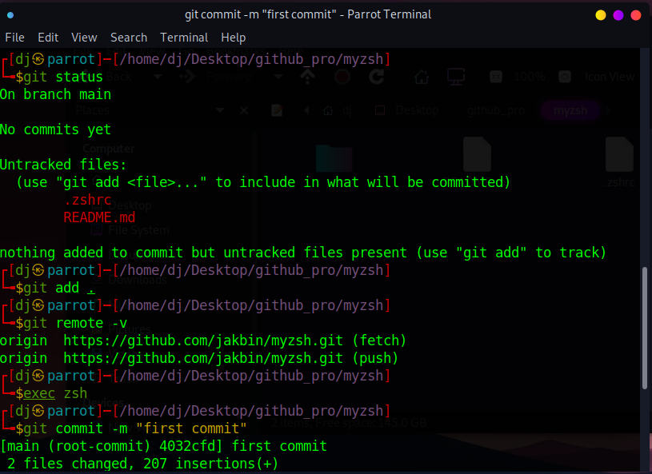
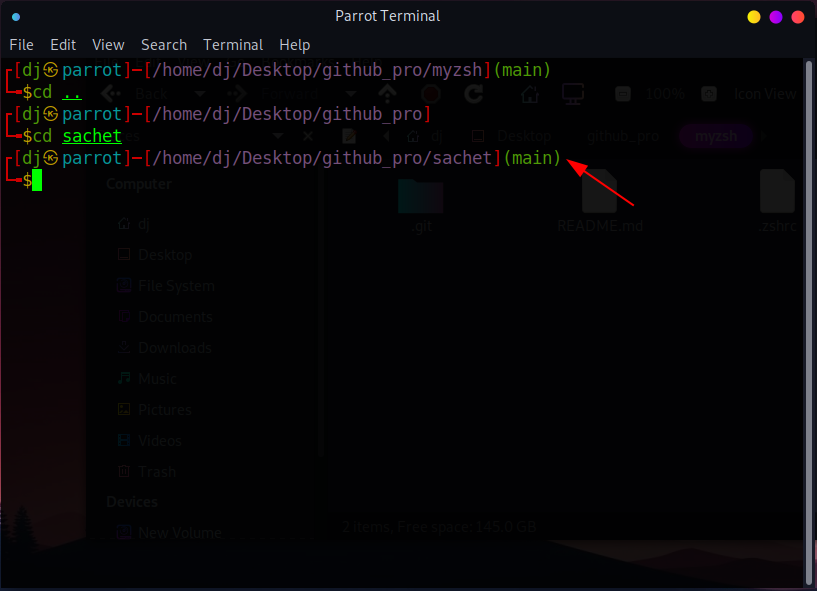
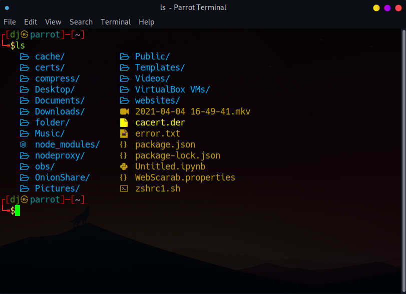
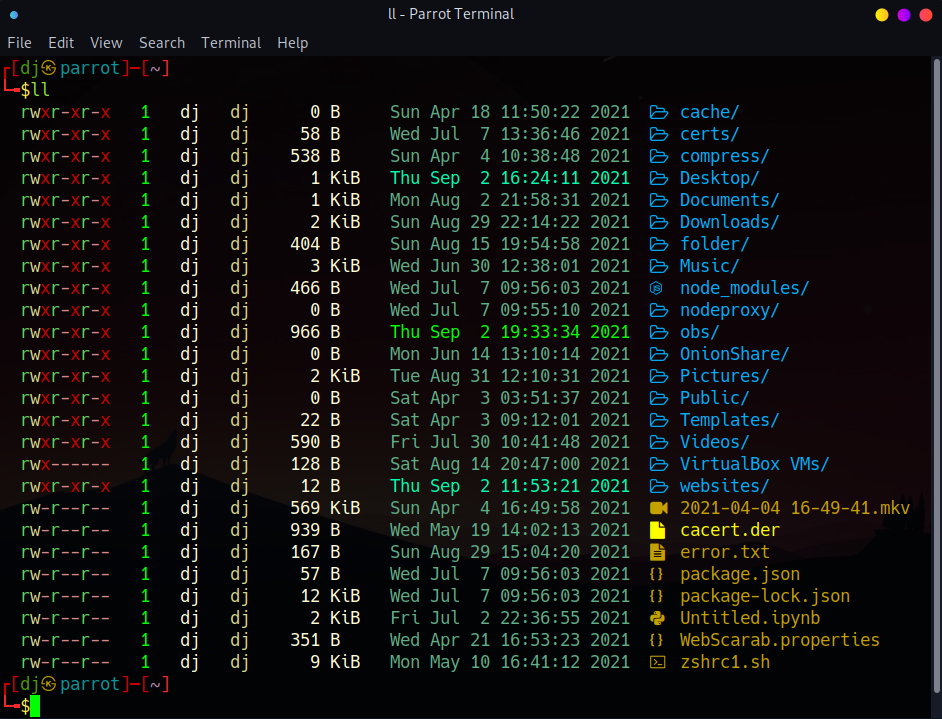

# Myzsh

Best vanilla theme for yuor zsh terminal (using without ohmyzsh).

## Here for turmux [Termux-zsh](termux/README.md)

## Features

* Dynamic git branch name
* Colourful outputs
* file icons
* command auto-suggestion
* command auto-complete

## Prerequisite

* [zsh-syntax-highlighting](https://github.com/zsh-users/zsh-syntax-highlighting)
* [zsh-autosuggestions](https://github.com/zsh-users/zsh-autosuggestions) (install from repo or github)
* [zsh-autocomplete](https://github.com/marlonrichert/zsh-autocomplete) (install from repo or github)
* [nerd-fonts](https://github.com/ryanoasis/nerd-fonts)
* [lsd](https://github.com/Peltoche/lsd) or [colorls](https://github.com/athityakumar/colorls) ( i prefer colorls because its also support git changes)

## install

```sh
curl 'https://raw.githubusercontent.com/jakbin/myzsh/main/install.sh' | sh
```

## install plugins

```sh
wget 'https://raw.githubusercontent.com/jakbin/myzsh/main/plugin-install.sh' && bash plugin-install.sh
```

### Screenshts

<p align="center">  </p>

Git branch name

<p align="center">  </p>

ls 

<p align="center">  </p>

ls -l

<p align="center">  </p>
